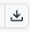

# MandArt Discoveries

Welcome to the MandArt Discoveries repository! 
This repository is a shared space for storing and sharing discoveries 
made by exploring the Mandelbrot set, and its complement, and boundary using MandArt.

Click here to see some interesting discoveries:

 - [Contributed by Bruce H Johnson](brucehjohnson/_index.md)

-----

## MandArt (the App)

These discoveries were made using MandArt, available at the link below.

- [MandArt (App Store)](https://apps.apple.com/us/app/mandart/id6445924588?mt=12) - runs on MacOS (v12+) - _Released!_

MandArt is s SwiftUI app for creating custom art with the Mandelbrot set.
It'a available for macOS (v12+) devices for download from the Apple App Store.
MandArt is not currently available for Windows or other non-compatible devices.
Documentation about MandArt, the Mandelbrot set, and how to create custom MandArt 
is available on the web. 

- [MandArt Documentation (website)](https://denisecase.github.io/MandArt-Docs/documentation/mandart/)

## MandArt Discoveries

The Mandelbrot set has been called one of "the most complex objects" known. 
We could look forever and stil find new things. 

Use the following site to explore some of the interesting patterns discovered so far.
You can use this site to download the examples, color them as you like, 
or use them to start new journeys.
If you make a new discovery or create custom art, we'd love to see it!

- [MandArt Discoveries](https://github.com/denisecase/MandArt-Discoveries)

-----

## Download Discoveries to Open them in MandArt

You can explore any of these discoveries in MandArt on your Mac.
To open the document on your machine for futher exploration, follow these steps.

1. In GitHub, click the "Click here to download" link above an image to jump to the associated .mandart document file in GitHub.
2. On the GitHub page for the document, click the download icon in the upper right corner to download the .mandart document to your machine. 
2. On your Mac, double-click the .mandart document on your machine (use Finder as needed) to open the document in MandArt.
3. In MandArt, you can use the various inputs to zoom out (-) and see where the landscape is located, modify the colors, or explore further.

When viewing the .mandart document file in GitHub, the download icon in the upper right of the document window looks like this:

-----

## Contributing

We welcome contributions from anyone interested in sharing their MandArt discoveries with the community. 

Before contributing, please review the following guidelines and requirements:

- Ensure that your .mandart document is valid and can be opened by the MandArt application.
- If your file contains confidential information, please do not include it in the repository.

We organize contributions by contributor. 
We'll ask for the following in addition to your .mandart document:

- Contributor username. Your GitHub account name works great.
- Your document should have a descriptive name with a .mandart extension.
- If you like, include a brief description when you share.

There are several ways to contribute. 

### Contributing by Creating an Issue (Recommended)

If you would like to contribute to this repository, 
create a new issue (it's a lot like creating a new item on a task list) 
and attach your .mandart document to the issue. 

To create a new issue:

1. Click the "Issues" tab at the top of this GitHub repository page.
2. Click the "New issue" button.
3. Provide a **title** for your issue.
4. In the issue description, include comments or a description as desired.
5. Attach your .mandart document to the issue.
6. Click the "Submit new issue" button.

We'll review your contribution, and on acceptance, merge it into the repository.

### Contributing by Forking and Making a Pull Request (Advanced)

If you would like to contribute to this repository by 
adding a .mandart document, 
you can fork this repository and make a pull request with your changes. 

To make a pull request:

1. Fork this repository by clicking on the "Fork" button at the top of the repository page.
2. Clone your forked repository to your local machine.
3. Make your changes to the .mandart documents.
4. Commit your changes with a clear and descriptive commit message.
5. Push your changes to your forked repository.
6. Click on the "New pull request" button on the original repository page.
7. Select your forked repository and the branch containing your changes.
8. Provide a clear and descriptive title and description for your pull request.
9. Click on the "Create pull request" button.

We will review your pull request, and on acceptance, merge it into the repository.

-----

## License

Content is licensed under the [MIT License](LICENSE).
By contributing, you agree to license your contributions under the same.

## Code of Conduct

We strive to maintain a welcoming and inclusive community for all contributors. 
We ask that all contributors follow our [Code of Conduct](CODE_OF_CONDUCT.md).

## Contact

If you have any questions or feedback about this repository, 
please visit our [GitHub Discussions](https://github.com/denisecase/MandArt-Discoveries/discussions) page. 
We look forward to hearing from you!

-----

## Source

- [MandArt source repo](https://github.com/brucehjohnson/MandArt) 
- [MandArt-Docs source repo](https://github.com/denisecase/MandArt-Docs)
