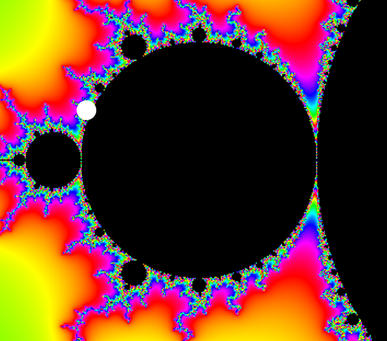
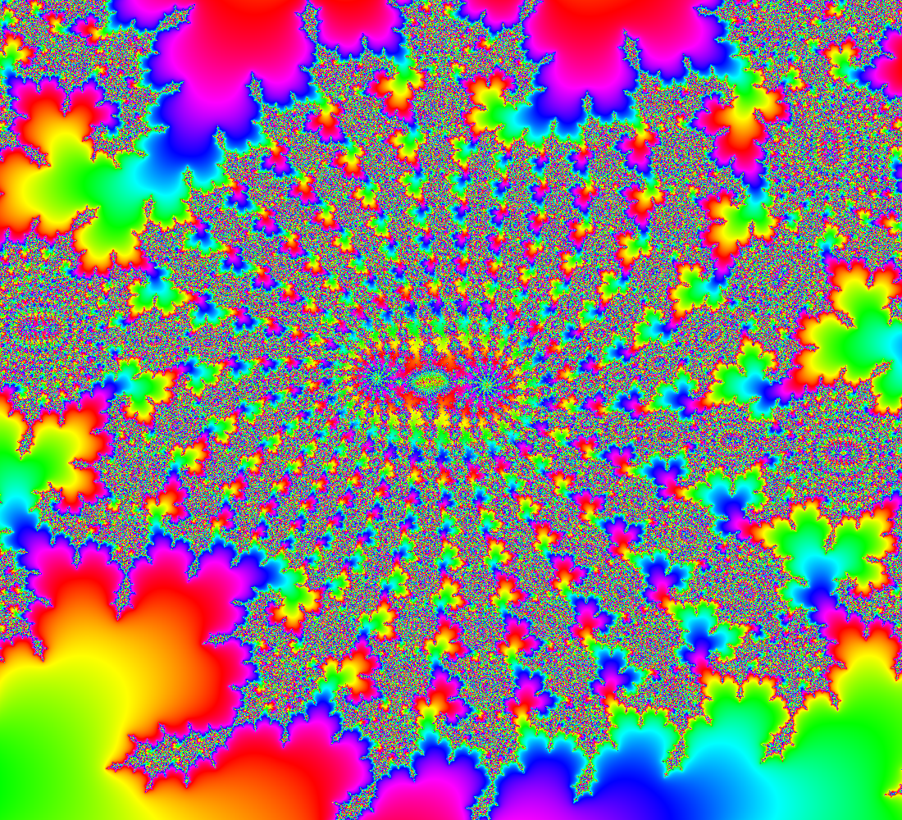

# AAK

Contributed by:

- [github.com/brucehjohnson](https://github.com/brucehjohnson)

Discoveries folder:

- [MandArt-Discoveries/brucehjohnson](https://github.com/denisecase/MandArt-Discoveries/tree/main/brucehjohnson)

-----

These are taken from the AAK region. 

-----

## AAK1

<a href="AAJ1.mandart" download="AAK1.mandart">Click here to download</a> 

## AAK2

<a href="AAK2.mandart" download="AAK2.mandart">Click here to download</a> 

