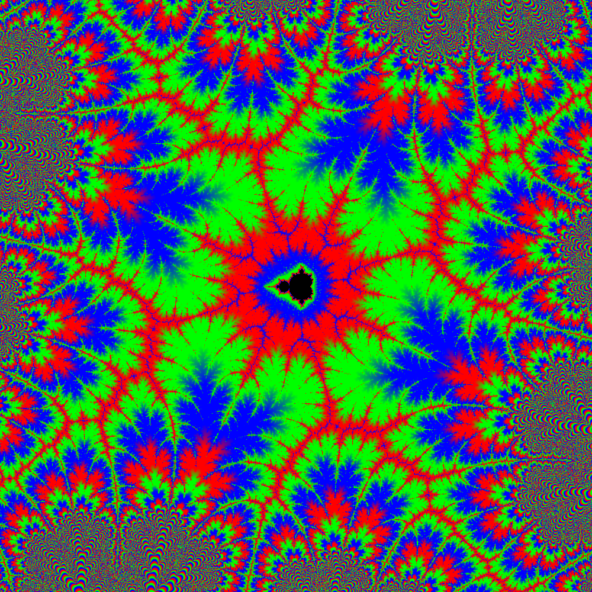

# brucehjohnson/MAPPED/DaError: 2.90268339044 exceeds the maximum allowed value of 1.25.

Contributed by:

- [github.com/brucehjohnson](https://github.com/brucehjohnson)

Discoveries folder:

- [MandArt-Discoveries/brucehjohnson](https://github.com/denisecase/MandArt-Discoveries/tree/main/brucehjohnson)

-----

These are taken from the brucehjohnson/MAPPED/DaError: 2.90268339044 exceeds the maximum allowed value of 1.25. region. 

## DaError:

Not available for download

## 2.90268339044

Not available for download

## exceeds

Not available for download

## the

Not available for download

## maximum

Not available for download

## allowed

Not available for download

## value

Not available for download

## of

Not available for download

## Frame19

Not available for download

