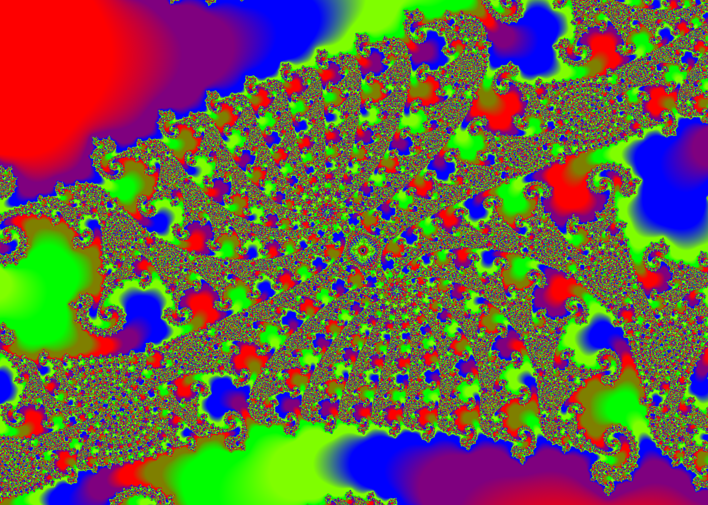
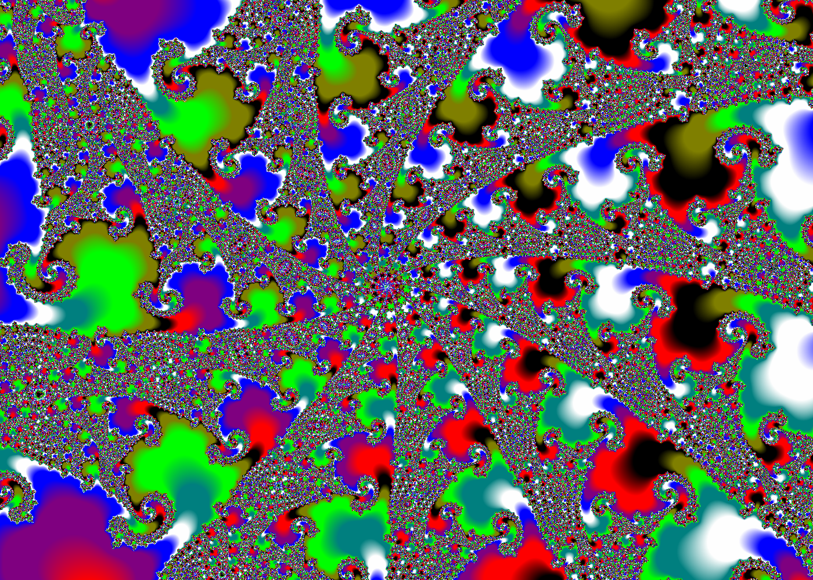
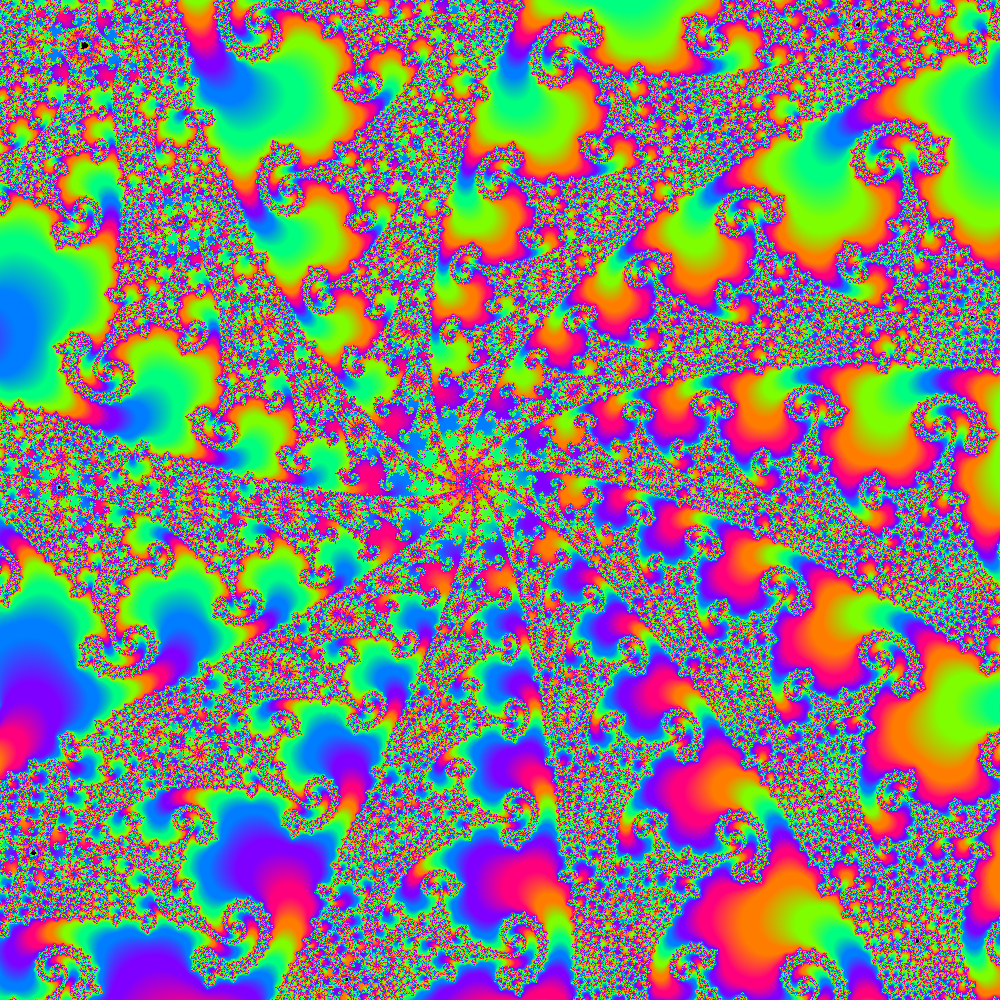

# brucehjohnson/MAPPED/Fd03

Contributed by:

- [github.com/brucehjohnson](https://github.com/brucehjohnson)

Discoveries folder:

- [MandArt-Discoveries/brucehjohnson](https://github.com/denisecase/MandArt-Discoveries/tree/main/brucehjohnson)

-----

These are taken from the brucehjohnson/MAPPED/Fd03 region. 

## Frame01

<a href="Frame01.mandart" download="Frame01.mandart">Click here to download</a> 

## Frame01_1

<a href="Frame01_1.mandart" download="Frame01_1.mandart">Click here to download</a> 

## Frame02

<a href="Frame02.mandart" download="Frame02.mandart">Click here to download</a> 

## Frame02_1

<a href="Frame02_1.mandart" download="Frame02_1.mandart">Click here to download</a> 

## Frame03

<a href="Frame03.mandart" download="Frame03.mandart">Click here to download</a> 

## Frame03_1

<a href="Frame03_1.mandart" download="Frame03_1.mandart">Click here to download</a> 

## Frame04

<a href="Frame04.mandart" download="Frame04.mandart">Click here to download</a> 

## Frame04_1

<a href="Frame04_1.mandart" download="Frame04_1.mandart">Click here to download</a> 

## Frame05

<a href="Frame05.mandart" download="Frame05.mandart">Click here to download</a> 

## Frame05_1

<a href="Frame05_1.mandart" download="Frame05_1.mandart">Click here to download</a> 

