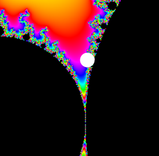

# brucehjohnson/MAPPED/Ga03

Contributed by:

- [github.com/brucehjohnson](https://github.com/brucehjohnson)

Discoveries folder:

- [MandArt-Discoveries/brucehjohnson](https://github.com/denisecase/MandArt-Discoveries/tree/main/brucehjohnson)

-----

These are taken from the brucehjohnson/MAPPED/Ga03 region. 

## Frame40

<a href="Frame40.mandart" download="Frame40.mandart">Click here to download</a> 

## Frame40_1

<a href="Frame40_1.mandart" download="Frame40_1.mandart">Click here to download</a> 

## Frame41

<a href="Frame41.mandart" download="Frame41.mandart">Click here to download</a> 

## Frame41_1

<a href="Frame41_1.mandart" download="Frame41_1.mandart">Click here to download</a> 

## Frame42

<a href="Frame42.mandart" download="Frame42.mandart">Click here to download</a> 

## Frame42_1

<a href="Frame42_1.mandart" download="Frame42_1.mandart">Click here to download</a> 

## Frame43

<a href="Frame43.mandart" download="Frame43.mandart">Click here to download</a> 

## Frame43_1

<a href="Frame43_1.mandart" download="Frame43_1.mandart">Click here to download</a> 

## Seahorse

<a href="Seahorse.mandart" download="Seahorse.mandart">Click here to download</a> 

## Seahorses

Not available for download

