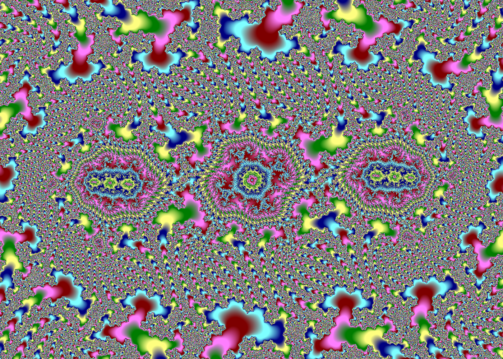

# brucehjohnson/MAPPED/Hb10

Contributed by:

- [github.com/brucehjohnson](https://github.com/brucehjohnson)

Discoveries folder:

- [MandArt-Discoveries/brucehjohnson](https://github.com/denisecase/MandArt-Discoveries/tree/main/brucehjohnson)

-----

These are taken from the brucehjohnson/MAPPED/Hb10 region. 

## AAG

Not available for download

## AAG1

<a href="AAG1.mandart" download="AAG1.mandart">Click here to download</a> 

## AAG2

<a href="AAG2.mandart" download="AAG2.mandart">Click here to download</a> 

## Frame27

<a href="Frame27.mandart" download="Frame27.mandart">Click here to download</a> 

## Frame27_1

<a href="Frame27_1.mandart" download="Frame27_1.mandart">Click here to download</a> 

## Frame28

<a href="Frame28.mandart" download="Frame28.mandart">Click here to download</a> 

## Frame28_1

<a href="Frame28_1.mandart" download="Frame28_1.mandart">Click here to download</a> 

