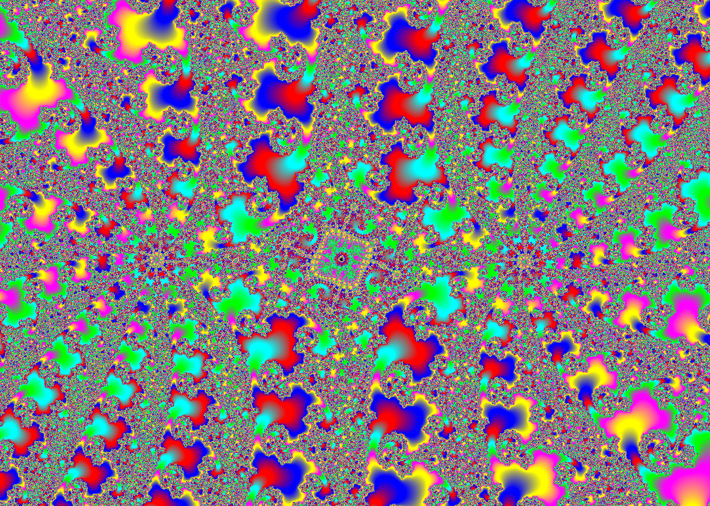
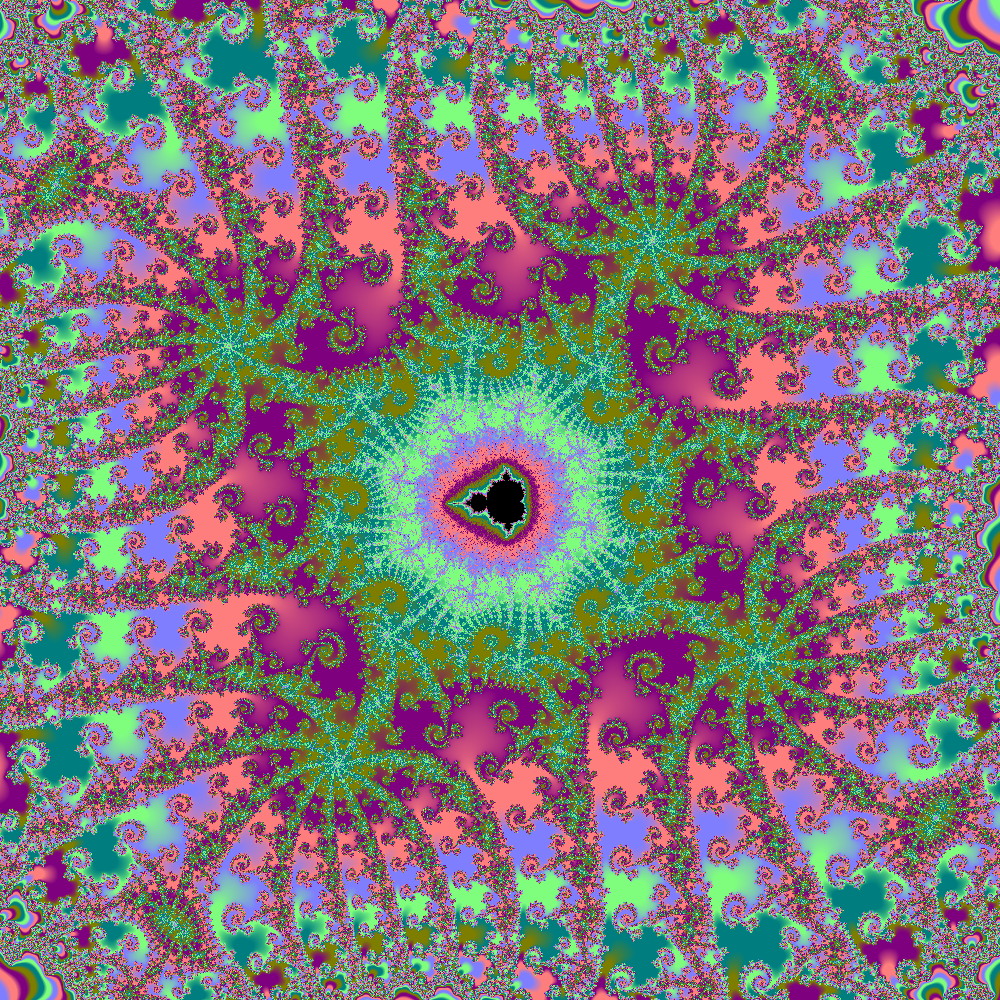

# brucehjohnson/MAPPED/Ia11

Contributed by:

- [github.com/brucehjohnson](https://github.com/brucehjohnson)

Discoveries folder:

- [MandArt-Discoveries/brucehjohnson](https://github.com/denisecase/MandArt-Discoveries/tree/main/brucehjohnson)

-----

These are taken from the brucehjohnson/MAPPED/Ia11 region. 

## Frame16

<a href="Frame16.mandart" download="Frame16.mandart">Click here to download</a> 

## Frame16_1

<a href="Frame16_1.mandart" download="Frame16_1.mandart">Click here to download</a> 

## Frame17

<a href="Frame17.mandart" download="Frame17.mandart">Click here to download</a> 

## Frame17_1

<a href="Frame17_1.mandart" download="Frame17_1.mandart">Click here to download</a> 

## Frame18

<a href="Frame18.mandart" download="Frame18.mandart">Click here to download</a> 

## Frame18_1

<a href="Frame18_1.mandart" download="Frame18_1.mandart">Click here to download</a> 

