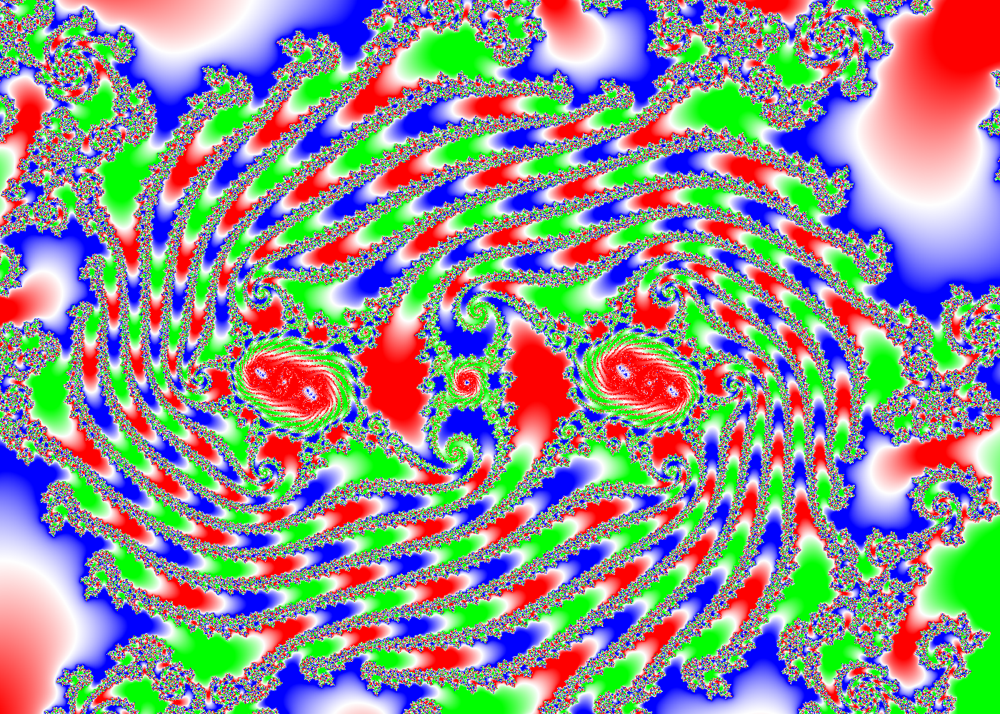

# brucehjohnson/MAPPED/Id11

Contributed by:

- [github.com/brucehjohnson](https://github.com/brucehjohnson)

Discoveries folder:

- [MandArt-Discoveries/brucehjohnson](https://github.com/denisecase/MandArt-Discoveries/tree/main/brucehjohnson)

-----

These are taken from the brucehjohnson/MAPPED/Id11 region. 

## Frame06

<a href="Frame06.mandart" download="Frame06.mandart">Click here to download</a> 

## Frame06_1

<a href="Frame06_1.mandart" download="Frame06_1.mandart">Click here to download</a> 

## Frame07

<a href="Frame07.mandart" download="Frame07.mandart">Click here to download</a> 

## Frame07_1

<a href="Frame07_1.mandart" download="Frame07_1.mandart">Click here to download</a> 

## Frame08

<a href="Frame08.mandart" download="Frame08.mandart">Click here to download</a> 

## Frame08_1

<a href="Frame08_1.mandart" download="Frame08_1.mandart">Click here to download</a> 

## Frame09

<a href="Frame09.mandart" download="Frame09.mandart">Click here to download</a> 

## Frame09_1

<a href="Frame09_1.mandart" download="Frame09_1.mandart">Click here to download</a> 

## Frame12

<a href="Frame12.mandart" download="Frame12.mandart">Click here to download</a> 

## Frame12_1

<a href="Frame12_1.mandart" download="Frame12_1.mandart">Click here to download</a> 

## Frame13

<a href="Frame13.mandart" download="Frame13.mandart">Click here to download</a> 

## Frame13_1

<a href="Frame13_1.mandart" download="Frame13_1.mandart">Click here to download</a> 

## Frame14

<a href="Frame14.mandart" download="Frame14.mandart">Click here to download</a> 

## Frame14_1

<a href="Frame14_1.mandart" download="Frame14_1.mandart">Click here to download</a> 

## Frame15

<a href="Frame15.mandart" download="Frame15.mandart">Click here to download</a> 

## Frame15_1

<a href="Frame15_1.mandart" download="Frame15_1.mandart">Click here to download</a> 

## Frame20

<a href="Frame20.mandart" download="Frame20.mandart">Click here to download</a> 

## Frame20_1

<a href="Frame20_1.mandart" download="Frame20_1.mandart">Click here to download</a> 

## Frame21

<a href="Frame21.mandart" download="Frame21.mandart">Click here to download</a> 

## Frame21_1

<a href="Frame21_1.mandart" download="Frame21_1.mandart">Click here to download</a> 

## Frame22

<a href="Frame22.mandart" download="Frame22.mandart">Click here to download</a> 

## Frame22_1

<a href="Frame22_1.mandart" download="Frame22_1.mandart">Click here to download</a> 

## Frame23

<a href="Frame23.mandart" download="Frame23.mandart">Click here to download</a> 

## Frame23_1

<a href="Frame23_1.mandart" download="Frame23_1.mandart">Click here to download</a> 

## Frame24

<a href="Frame24.mandart" download="Frame24.mandart">Click here to download</a> 

## Frame24_1

<a href="Frame24_1.mandart" download="Frame24_1.mandart">Click here to download</a> 

## Frame25

<a href="Frame25.mandart" download="Frame25.mandart">Click here to download</a> 

## Frame25_1

<a href="Frame25_1.mandart" download="Frame25_1.mandart">Click here to download</a> 

## Frame26

<a href="Frame26.mandart" download="Frame26.mandart">Click here to download</a> 

## Frame26_1

<a href="Frame26_1.mandart" download="Frame26_1.mandart">Click here to download</a> 

