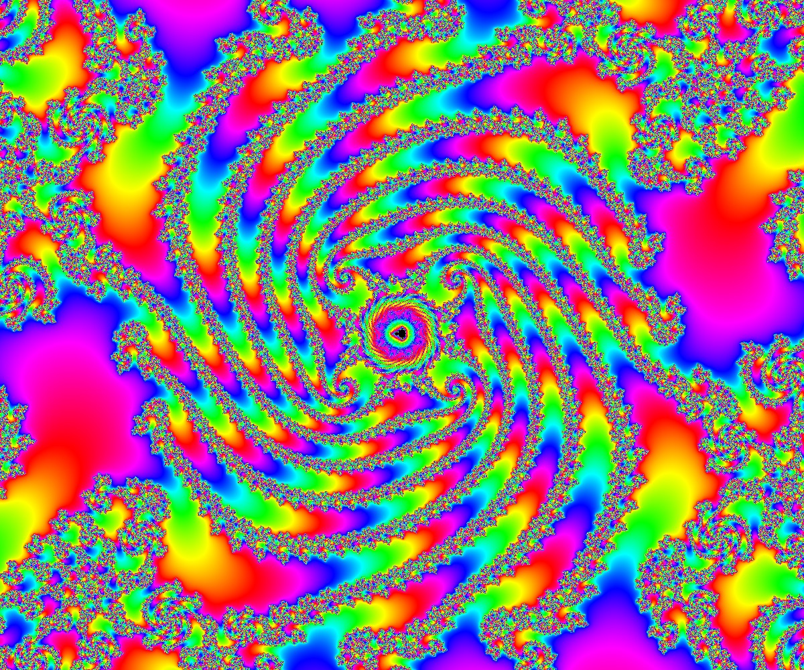
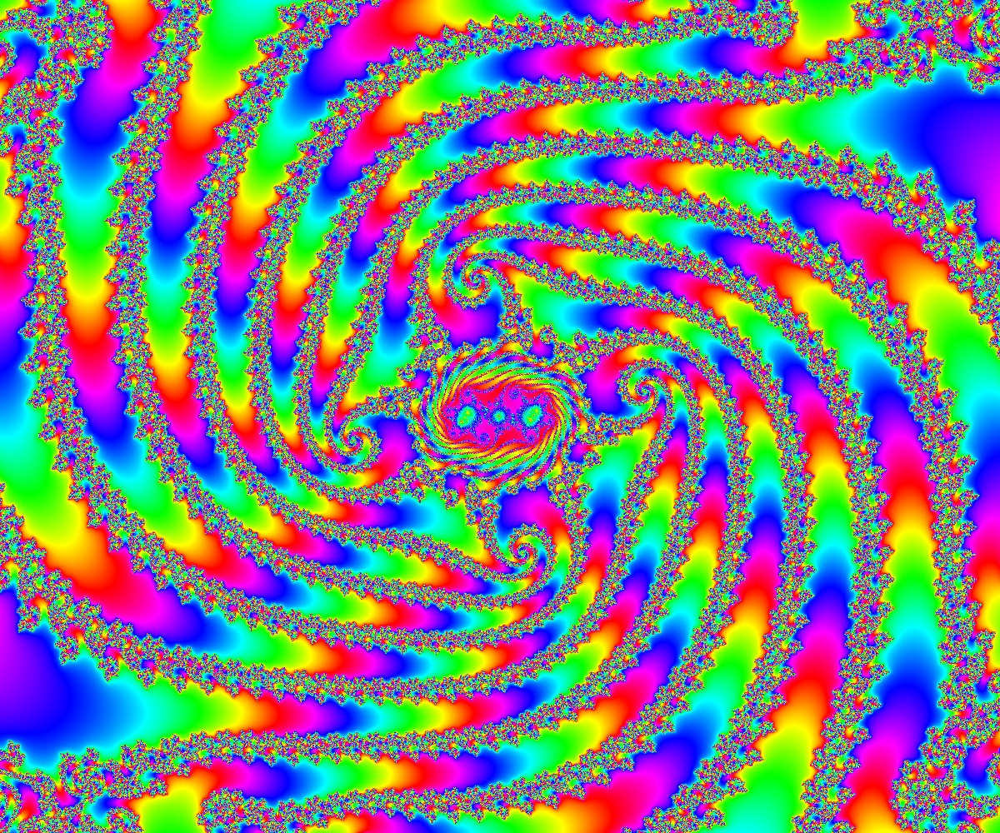
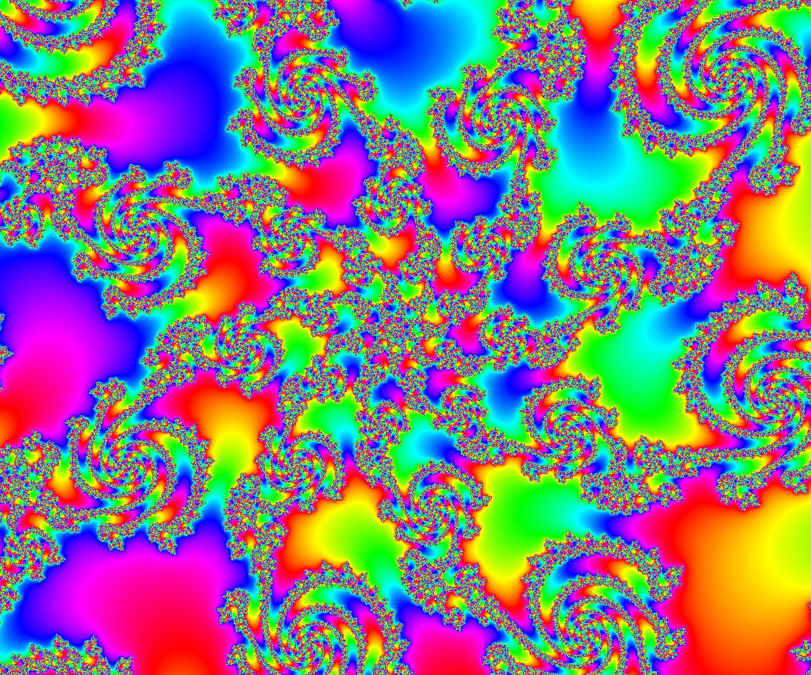
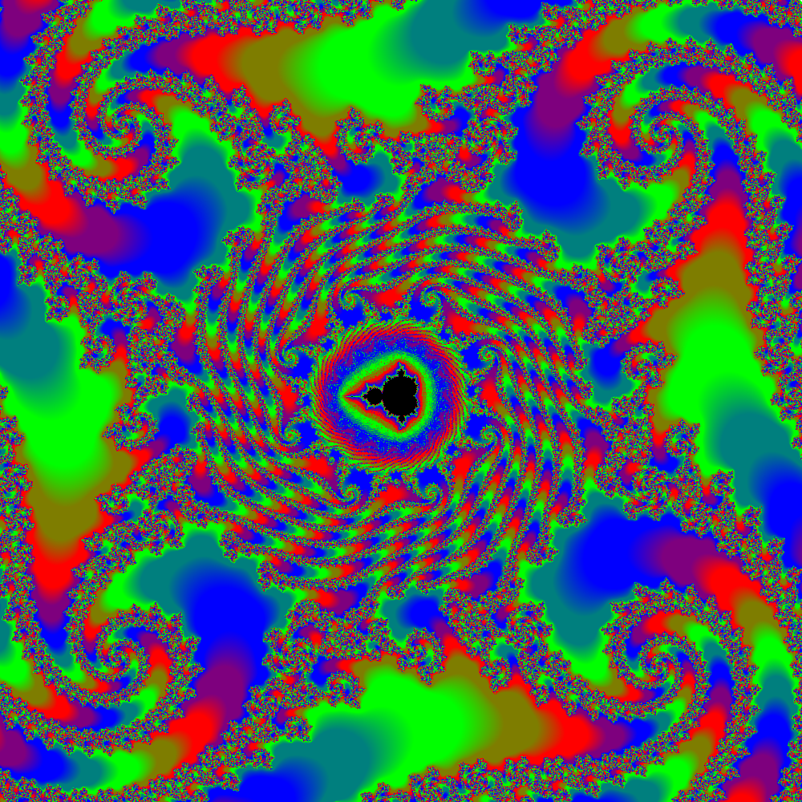
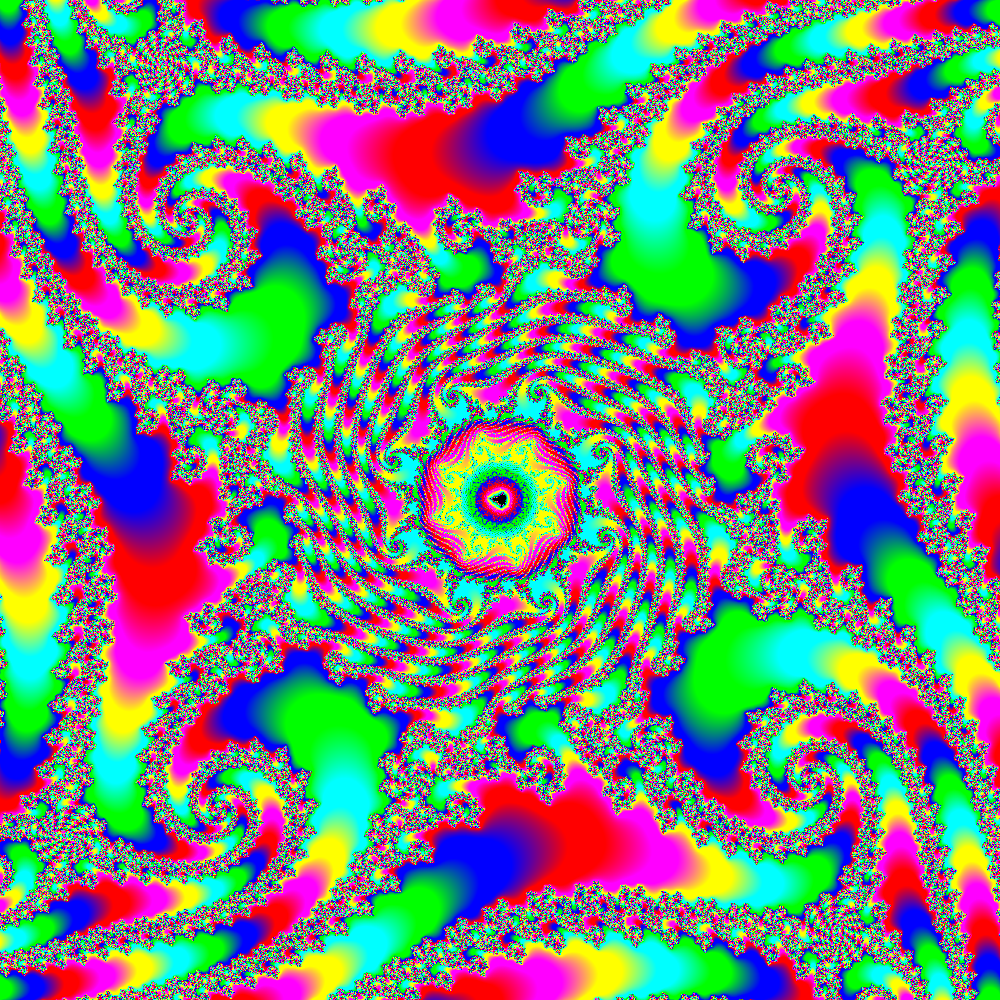

# brucehjohnson/MAPPED/Id11

Contributed by:

- [github.com/brucehjohnson](https://github.com/brucehjohnson)

Discoveries folder:

- [MandArt-Discoveries/brucehjohnson](https://github.com/denisecase/MandArt-Discoveries/tree/main/brucehjohnson)

-----

These are taken from the brucehjohnson/MAPPED/Id11 region. 

## AAA

Not available for download

## AAA04

Not available for download

## AAA06

Not available for download

## AAA1

<a href="AAA1.mandart" download="AAA1.mandart">Click here to download</a> 

## AAA10

<a href="AAA10.mandart" download="AAA10.mandart">Click here to download</a> 

## AAA12

<a href="AAA12.mandart" download="AAA12.mandart">Click here to download</a> 

## AAA13

<a href="AAA13.mandart" download="AAA13.mandart">Click here to download</a> 

## AAA2

<a href="AAA2.mandart" download="AAA2.mandart">Click here to download</a> 

## AAA3

<a href="AAA3.mandart" download="AAA3.mandart">Click here to download</a> 

## AAA4copy

Not available for download

## AAA5

<a href="AAA5.mandart" download="AAA5.mandart">Click here to download</a> 

## AAA9

<a href="AAA9.mandart" download="AAA9.mandart">Click here to download</a> 

## AAAcopy

Not available for download

## AAE

Not available for download

## AAE1

<a href="AAE1.mandart" download="AAE1.mandart">Click here to download</a> 

## AAE2

<a href="AAE2.mandart" download="AAE2.mandart">Click here to download</a> 

## AAE3

<a href="AAE3.mandart" download="AAE3.mandart">Click here to download</a> 

## AAE4

<a href="AAE4.mandart" download="AAE4.mandart">Click here to download</a> 

## AAE5

<a href="AAE5.mandart" download="AAE5.mandart">Click here to download</a> 

## AAF

Not available for download

## AAF1

<a href="AAF1.mandart" download="AAF1.mandart">Click here to download</a> 

## AAF2

<a href="AAF2.mandart" download="AAF2.mandart">Click here to download</a> 

## AAF3

<a href="AAF3.mandart" download="AAF3.mandart">Click here to download</a> 

## AAF4

<a href="AAF4.mandart" download="AAF4.mandart">Click here to download</a> 

## Frame06

<a href="Frame06.mandart" download="Frame06.mandart">Click here to download</a> 

## Frame07

<a href="Frame07.mandart" download="Frame07.mandart">Click here to download</a> 

## Frame08

<a href="Frame08.mandart" download="Frame08.mandart">Click here to download</a> 

## Frame09

<a href="Frame09.mandart" download="Frame09.mandart">Click here to download</a> 

## Frame12

<a href="Frame12.mandart" download="Frame12.mandart">Click here to download</a> 

## Frame13

<a href="Frame13.mandart" download="Frame13.mandart">Click here to download</a> 

## Frame14

<a href="Frame14.mandart" download="Frame14.mandart">Click here to download</a> 

## Frame15

<a href="Frame15.mandart" download="Frame15.mandart">Click here to download</a> 

## Frame20

<a href="Frame20.mandart" download="Frame20.mandart">Click here to download</a> 

## Frame21

<a href="Frame21.mandart" download="Frame21.mandart">Click here to download</a> 

## Frame22

<a href="Frame22.mandart" download="Frame22.mandart">Click here to download</a> 

## Frame23

<a href="Frame23.mandart" download="Frame23.mandart">Click here to download</a> 

## Frame24

<a href="Frame24.mandart" download="Frame24.mandart">Click here to download</a> 

## Frame25

<a href="Frame25.mandart" download="Frame25.mandart">Click here to download</a> 

## Frame26

<a href="Frame26.mandart" download="Frame26.mandart">Click here to download</a> 

## Frame26_1

<a href="Frame26_1.mandart" download="Frame26_1.mandart">Click here to download</a> 

