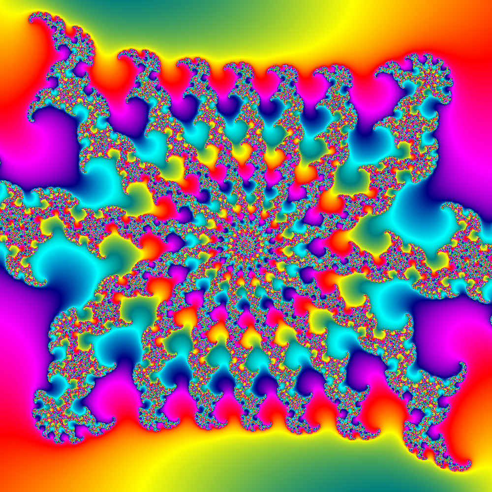

# brucehjohnson/MAPPED/Ka02

Contributed by:

- [github.com/brucehjohnson](https://github.com/brucehjohnson)

Discoveries folder:

- [MandArt-Discoveries/brucehjohnson](https://github.com/denisecase/MandArt-Discoveries/tree/main/brucehjohnson)

-----

These are taken from the brucehjohnson/MAPPED/Ka02 region. 

## Frame29

<a href="Frame29.mandart" download="Frame29.mandart">Click here to download</a> 

## Frame30

<a href="Frame30.mandart" download="Frame30.mandart">Click here to download</a> 

## Frame31

<a href="Frame31.mandart" download="Frame31.mandart">Click here to download</a> 

## Frame32

<a href="Frame32.mandart" download="Frame32.mandart">Click here to download</a> 

## Frame44

<a href="Frame44.mandart" download="Frame44.mandart">Click here to download</a> 

## Frame45

<a href="Frame45.mandart" download="Frame45.mandart">Click here to download</a> 

## Frame46

<a href="Frame46.mandart" download="Frame46.mandart">Click here to download</a> 

## Frame48

<a href="Frame48.mandart" download="Frame48.mandart">Click here to download</a> 

## Frame49

<a href="Frame49.mandart" download="Frame49.mandart">Click here to download</a> 

## Frame50

<a href="Frame50.mandart" download="Frame50.mandart">Click here to download</a> 

