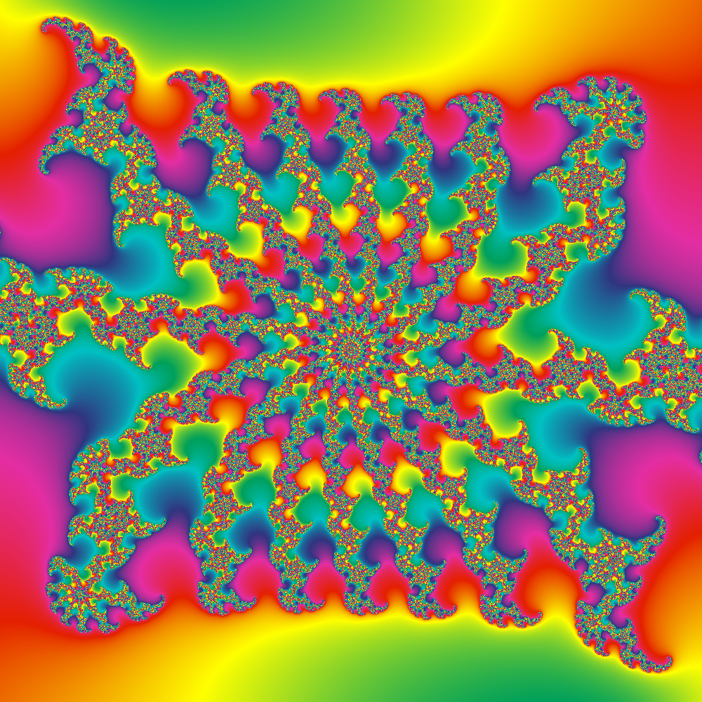
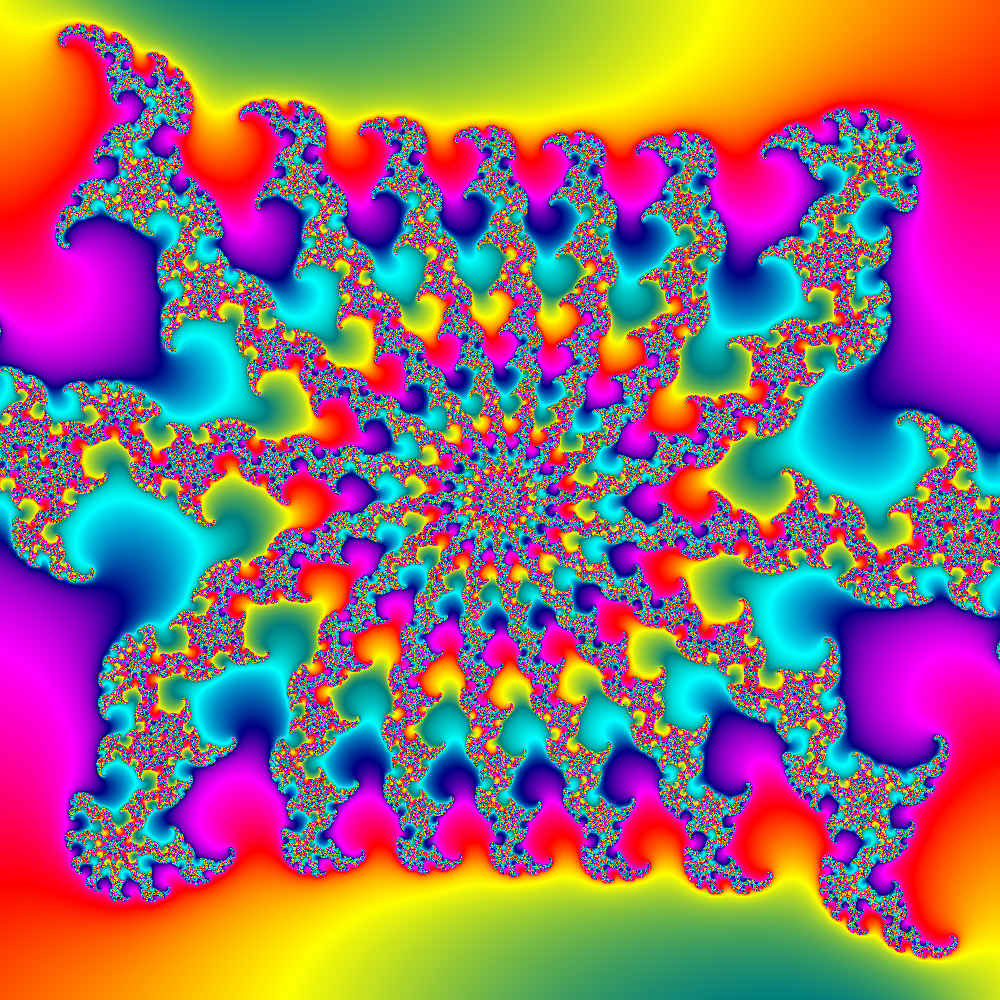

# brucehjohnson/MAPPED/Kc02

Contributed by:

- [github.com/brucehjohnson](https://github.com/brucehjohnson)

Discoveries folder:

- [MandArt-Discoveries/brucehjohnson](https://github.com/denisecase/MandArt-Discoveries/tree/main/brucehjohnson)

-----

These are taken from the brucehjohnson/MAPPED/Kc02 region. 

## Frame48

<a href="Frame48.mandart" download="Frame48.mandart">Click here to download</a> 

## Frame49

<a href="Frame49.mandart" download="Frame49.mandart">Click here to download</a> 

## Frame50

<a href="Frame50.mandart" download="Frame50.mandart">Click here to download</a> 

