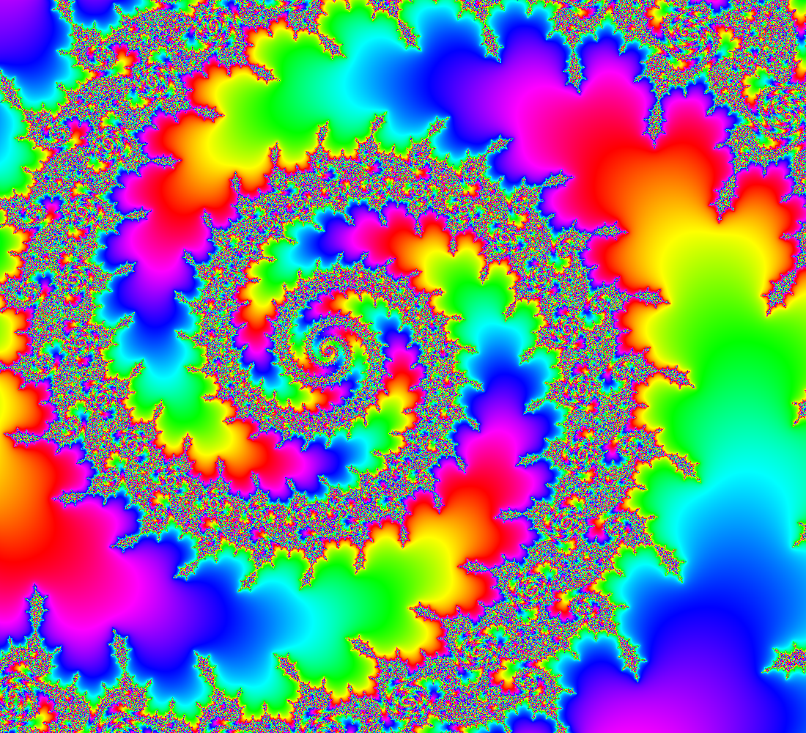
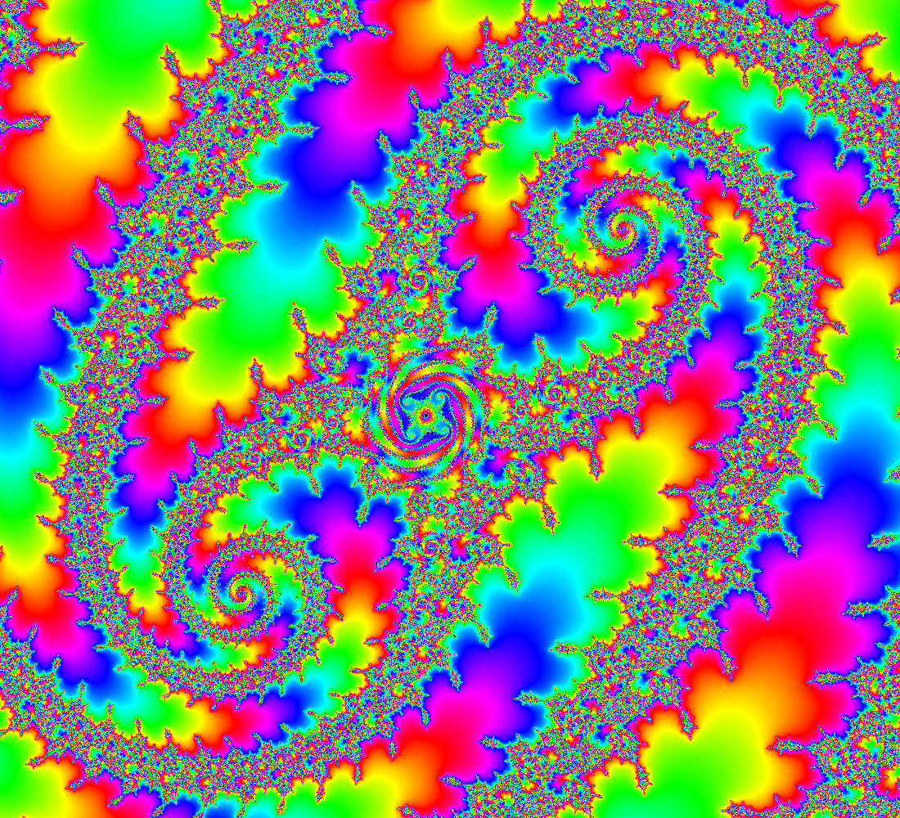
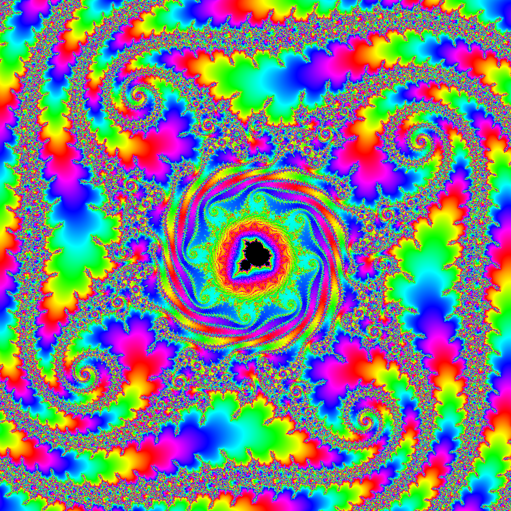
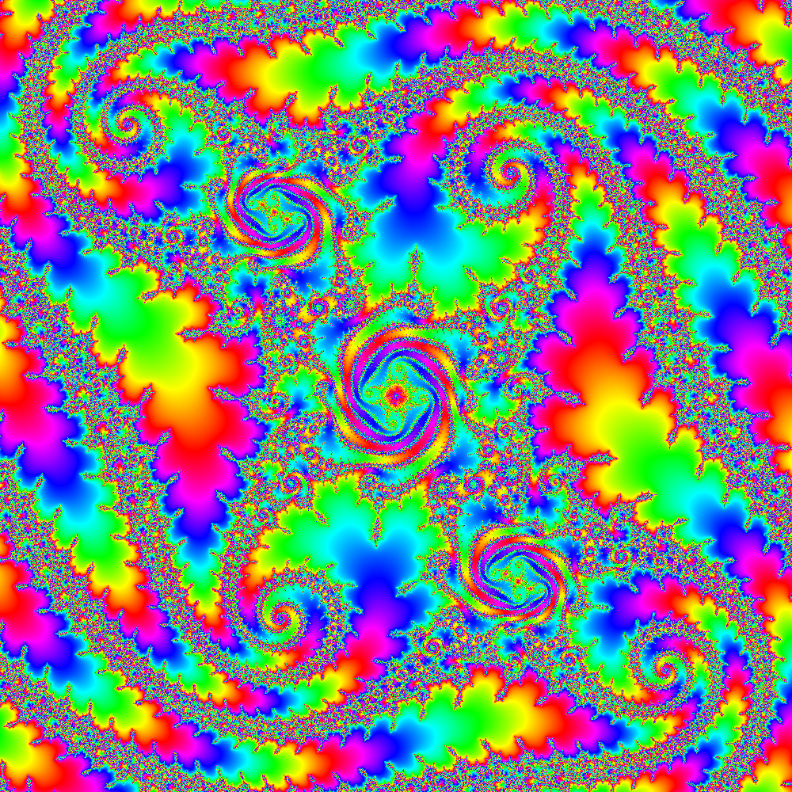

# AAL

Contributed by:

- [github.com/brucehjohnson](https://github.com/brucehjohnson)

Discoveries folder:

- [MandArt-Discoveries/brucehjohnson](https://github.com/denisecase/MandArt-Discoveries/tree/main/brucehjohnson)

-----

These are taken from the AAL region. 

-----

## AAL1

<a href="AAL1.mandart" download="AAL1.mandart">Click here to download</a> 

## AAL2

<a href="AAL2.mandart" download="AAL2.mandart">Click here to download</a> 

## AAL3

<a href="AAL3.mandart" download="AAL3.mandart">Click here to download</a> 

## AAL4

<a href="AAL4.mandart" download="AAL4.mandart">Click here to download</a> 

## AAL5

<a href="AAL5.mandart" download="AAL5.mandart">Click here to download</a> 

