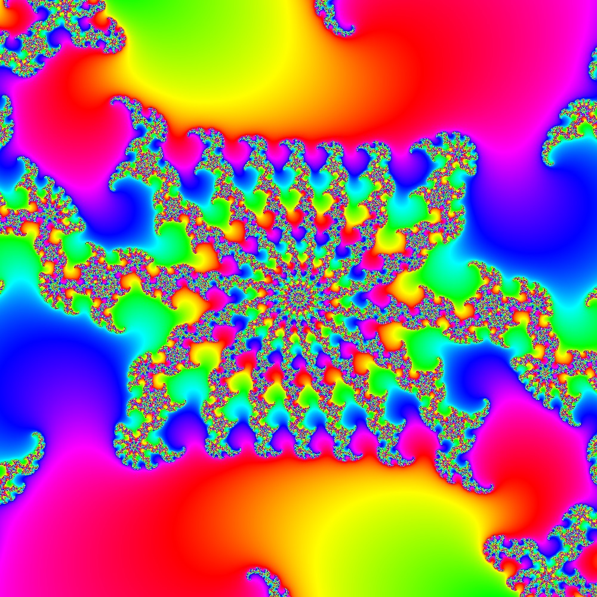
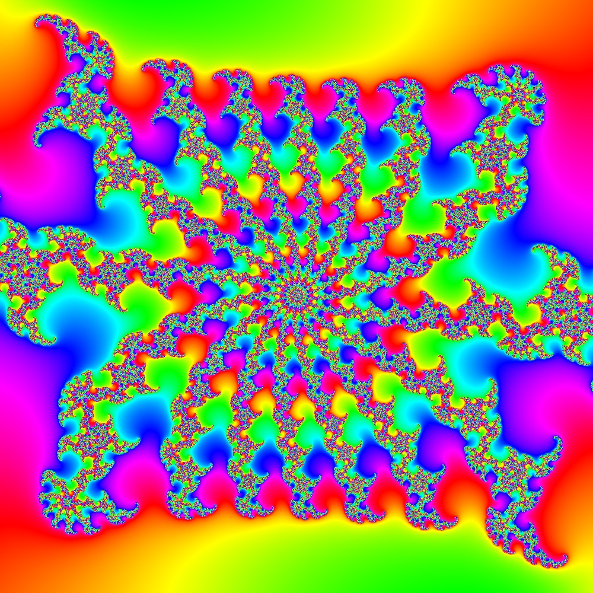

# Rectangles

Contributed by:

- [brucehjohnson](https://github.com/brucehjohnson)

## Rectangle 1

<a href="Rectangle1.mandart" download="Diamond1.mandart">Click here to download</a> 

## Rectangle 2

<a href="Rectangle2.mandart" download="Diamond1.mandart">Click here to download</a> 

## Rectangle 3

<a href="Rectangle3.mandart" download="Diamond1.mandart">Click here to download</a> 

## Rectangle 4

<a href="Rectangle4.mandart" download="Diamond1.mandart">Click here to download</a> 

## Rectangle 5

<a href="Rectangle5.mandart" download="Diamond1.mandart">Click here to download</a> 

