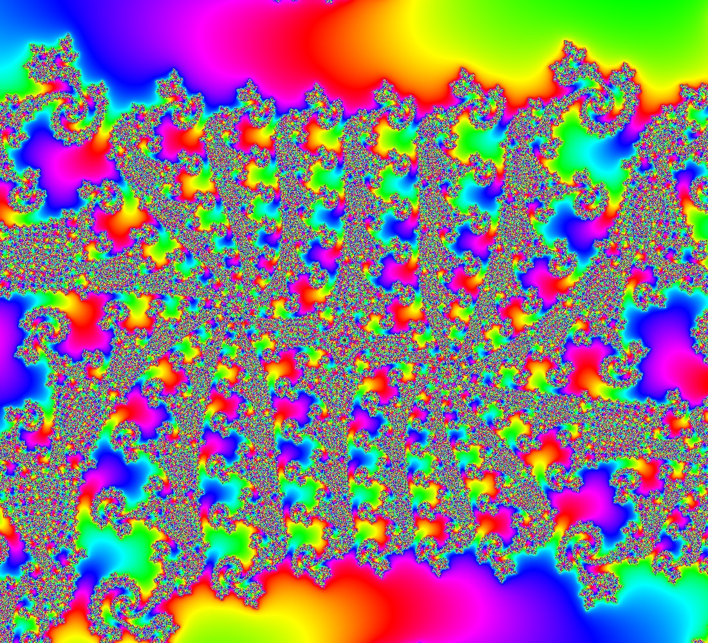
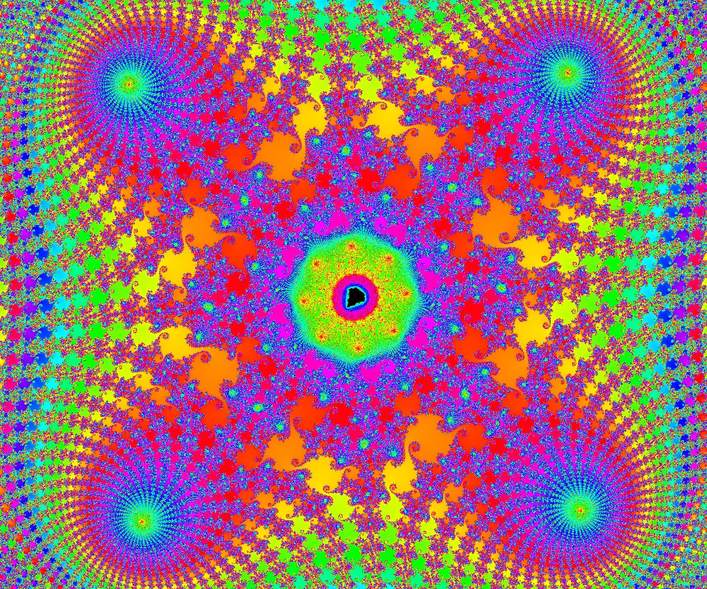

# Shared MandArtDiscoveries

Contributed by:

- [brucehjohnson](https://github.com/brucehjohnson)

-----

## [Lefts](Lefts/_index.md)

- See all [Lefts](Lefts/_index.md)

This is not the main Mandlebrot set - it's near the very far left of the landscape. 
Download, open in MandArt, and zoom all the way out to see where we are looking. 

[Download](Lefts/Left1.mandart)

-----

## [Rectangles](Rectangles/_index.md)

- See all [Rectangles](Rectangles/_index.md)

[Download](Rectangles/Rectangle2.mandart)

-----

## [Rounds](Rounds/_index.md)

- See all [Rounds](Rounds/_index.md)

[Download](Rounds/Round1.mandart)

-----

## [Seahorses](Seahorses/_index.md)

- See all [Seahorses](Seahorses/_index.md)

[Download](Seahorses/Seahorse.mandart)

-----

## [Spirals](Spirals/_index.md)

- See all [Spirals](Spirals/_index.md)

[Download](Spirals/Spiral1.mandart)

-----

## [Swirls](Swirls/_index.md)

- See all [Swirls](Swirls/_index.md)

[Download](Swirls/10Swirl1.mandart)

-----

## [Tops](Tops/_index.md)

- See all [Tops](Tops/_index.md)

[Download](Tops/Top1.mandart)

-----

## Earlier Examples

### MandArt 1

[Download](MandArt1.mandart)

### MandArt 2

[Download](MandArt2.mandart)

### MandArt 3

[Download](MandArt3.mandart)

### MandArt 4

[Download](MandArt4.mandart)

### MandArt 5

[Download](MandArt5.mandart)

### MandArt 6

[Download](MandArt6.mandart)

### MandArt 7

[Download](MandArt7.mandart)

### MandArt 8

[Download](MandArt8.mandart)

### Rectangle 1

[Download](Rectangle1.mandart)

### Rectangle 2

[Download](Rectangle2.mandart)

### Rectangle 3

[Download](Rectangle3.mandart)

### Rectangle 4

[Download](Rectangle4.mandart)

### Rectangle 5

[Download](Rectangle5.mandart)

### Sea Horse

[Download](Seahorse.mandart)

