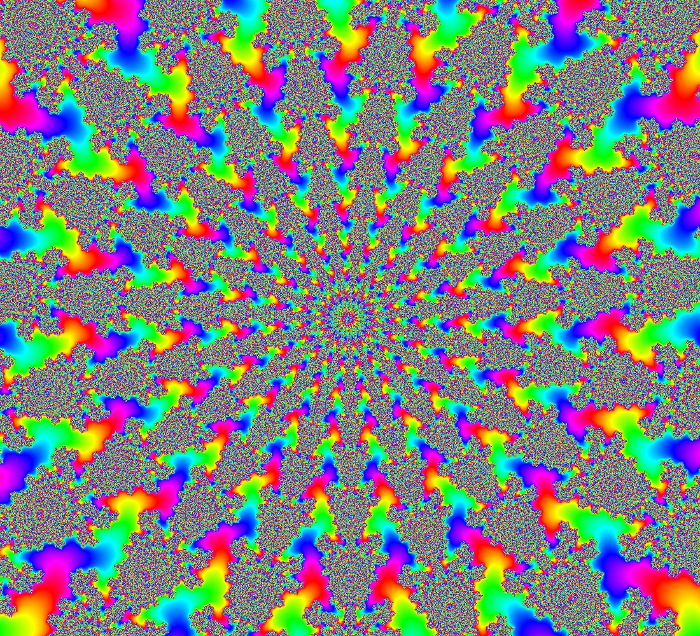
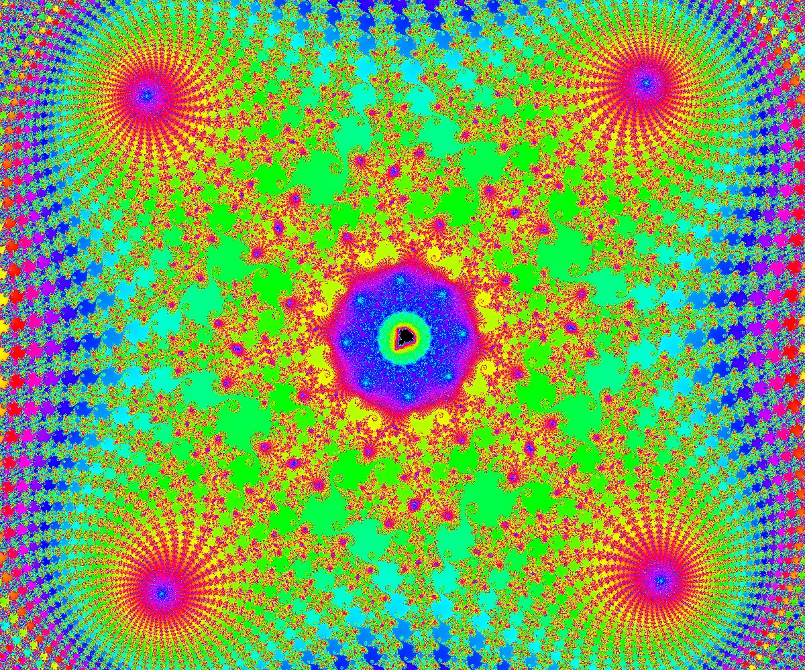

# Shared MandArtDiscoveries

Contributed by:

- [github.com/brucehjohnson](https://github.com/brucehjohnson)

Discoveries folder:

- [MandArt-Discoveries/brucehjohnson](https://github.com/denisecase/MandArt-Discoveries/tree/main/brucehjohnson)

-----

## [AAA](AAA/index.md)

- See all [AAA](AAA/index.md)

These are taken from the AAA region. 

<a href="AAA/AAA1.mandart" download="AAA1.mandart">Click here to download</a> 
Then click "Raw", then from Safari menu, File / Save As...

-----

## [AAB](AAB/index.md)

- See all [AAB](AAB/index.md)

These are taken from the AAB region. 

<a href="AAB/AAB1.mandart" download="AAB1.mandart">Click here to download</a> 
Then click "Raw", then from Safari menu, File / Save As...

-----
## [AAC](AAC/index.md)

- See all [AAC](AAC/index.md)

These are taken from the AAC region. 

<a href="AAC/AAC1.mandart" download="AAC1.mandart">Click here to download</a> 
Then click "Raw", then from Safari menu, File / Save As...

-----
## [AAD](AAD/index.md)

- See all [AAD](AAD/index.md)

These are taken from the AAD region. 

<a href="AAD/AAD1.mandart" download="AAD1.mandart">Click here to download</a> 
Then click "Raw", then from Safari menu, File / Save As...

-----
## [AAE](AAE/index.md)

- See all [AAE](AAE/index.md)

These are taken from the AAE region. 

<a href="AAE/AAE1.mandart" download="AAE1.mandart">Click here to download</a> 
Then click "Raw", then from Safari menu, File / Save As...

-----
## [AAF](AAF/index.md)

- See all [AAF](AAF/index.md)

These are taken from the AAF region. 

<a href="AAF/AAF1.mandart" download="AAF1.mandart">Click here to download</a> 
Then click "Raw", then from Safari menu, File / Save As...

-----
## [AAG](AAG/index.md)

- See all [AAG](AAG/index.md)

These are taken from the AAG region. 

<a href="AAG/AAG1.mandart" download="AAG1.mandart">Click here to download</a> 
Then click "Raw", then from Safari menu, File / Save As...

-----
## [AAJ](AAJ/index.md)

- See all [AAJ](AAJ/index.md)

These are taken from the AAJ region. 

<a href="AAJ/AAJ1.mandart" download="AAJ1.mandart">Click here to download</a> 
Then click "Raw", then from Safari menu, File / Save As...

-----

## [Diamonds](Diamonds/index.md)

- See all [Diamonds](Diamonds/index.md)

These are taken from the Diamonds region. 

<a href="Diamonds/Diamond1.mandart" download="Diamond1.mandart">Click here to download</a> 

-----

## [Dragons](Dragons/index.md)

- See all [Dragons](Dragons/index.md)

These are taken from the  region. 

<a href="Dragons/Dragons3.mandart" download="Dragons3.mandart">Click here to download</a> 

-----

## [Lefts](Lefts/index.md)

- See all [Lefts](Lefts/index.md)
- 
These are taken from the Lefts region. 

The "Left" examples (see the one shown below), may look like the main Mandlebrot set.
Surprisingly, they are not. This example below is actually showing the very far _left_ of the landscape. 

<a href="Lefts/Left1.mandart" download="Left1.mandart">Click here to download</a> 

-----

## [Rectangles](Rectangles/index.md)

- See all [Rectangles](Rectangles/index.md)

These are taken from the Rectangles region. 

<a href="Rectangles/Rectangle2.mandart" download="Rectangle2.mandart">Click here to download</a> 

-----

## [Rounds](Rounds/index.md)

- See all [Rounds](Rounds/index.md)

These are taken from the Rounds region. 

<a href="Rounds/Round1.mandart" download="Round1.mandart">Click here to download</a> 

-----

## [Seahorses](Seahorses/index.md)

- See all [Seahorses](Seahorses/index.md)

These are taken from the Seahorses region. 

<a href="Seahorses/Seahorse.mandart" download="Seahorse.mandart">Click here to download</a> 

-----

## [Spirals](Spirals/index.md)

- See all [Spirals](Spirals/index.md)

These are taken from the Spirals region. 

<a href="Spirals/Spiral1.mandart" download="Spiral1.mandart">Click here to download</a> 

-----

## [Swirls](Swirls/index.md)

- See all [Swirls](Swirls/index.md)

These are taken from the Swirls region. 

<a href="Swirls/Swirl1.mandart" download="Swirl1.mandart">Click here to download</a> 

-----

## [Tops](Tops/index.md)

- See all [Tops](Tops/index.md)

These are taken from the Tops region. 

<a href="Tops/Top1.mandart" download="Top1.mandart">Click here to download</a> 

-----

## Earlier Examples

### MandArt 1

<a href="MandArt1.mandart" download="MandArt1.mandart">Click here to download</a> 

### MandArt 2

<a href="MandArt2.mandart" download="MandArt2.mandart">Click here to download</a> 

### MandArt 3

<a href="MandArt3.mandart" download="MandArt3.mandart">Click here to download</a> 

### MandArt 4

<a href="MandArt4.mandart" download="MandArt4.mandart">Click here to download</a> 

### MandArt 5

<a href="MandArt5.mandart" download="MandArt5.mandart">Click here to download</a> 

### MandArt 6

<a href="MandArt6.mandart" download="MandArt6.mandart">Click here to download</a> 

### MandArt 7

<a href="MandArt7.mandart" download="MandArt7.mandart">Click here to download</a> 

### MandArt 8

<a href="MandArt8.mandart" download="MandArt8.mandart">Click here to download</a> 

### Rectangle 1

<a href="Rectangle1.mandart" download="Rectangle1.mandart">Click here to download</a> 

### Rectangle 2

<a href="Rectangle2.mandart" download="Rectangle2.mandart">Click here to download</a> 

### Rectangle 3

<a href="Rectangle3.mandart" download="Rectangle3.mandart">Click here to download</a> 
No image available

### Rectangle 4

<a href="Rectangle4.mandart" download="Rectangle4.mandart">Click here to download</a> 
No image available

### Rectangle 5

<a href="Rectangle5.mandart" download="Rectangle5.mandart">Click here to download</a> 
No image available

### Sea Horse

<a href="Seahorse.mandart" download="Seahorse.mandart">Click here to download</a> 

