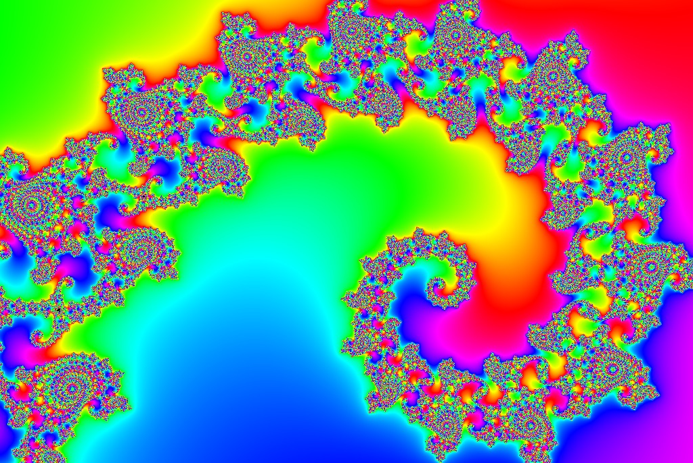

# Shared MandArtDiscoveries

Contributed by:

- [brucehjohnson](https://github.com/brucehjohnson)

-----

## [Diamonds](Diamonds/index.md)

- See all [Diamonds](Diamonds/index.md)

<a href="Diamonds/Diamond1.mandart" download="Diamond1.mandart">Click here to download</a> 

-----

## [Dragons](Dragons/index.md)

- See all [Dragons](Dragons/index.md)

<a href="Dragons/Dragons3.mandart" download="Dragons3.mandart">Click here to download</a> 

-----

## [Lefts](Lefts/index.md)

- See all [Lefts](Lefts/index.md)

The "Left" examples (see the one shown below), may look like the main Mandlebrot set.
Surprisingly, they are not. This example below is actually showing the very far _left_ of the landscape. 

<a href="Lefts/Left1.mandart" download="Left1.mandart">Click here to download</a> 

-----

## [Rectangles](Rectangles/)

- See all [Rectangles](Rectangles/)

<a href="Rectangles/Rectangle2.mandart" download="Rectangle2.mandart">Click here to download</a> 

-----

## [Rounds](Rounds/_index.md)

- See all [Rounds](Rounds/_index.md)

<a href="Rounds/Round1.mandart" download="Round1.mandart">Click here to download</a> 

-----

## [Seahorses](Seahorses/index.md)

- See all [Seahorses](Seahorses/index.md)

<a href="Seahorses/Seahorse.mandart" download="Seahorse.mandart">Click here to download</a> 

-----

## [Spirals](Spirals/_index.md)

- See all [Spirals](Spirals/_index.md)

<a href="Spirals/Spiral1.mandart" download="Spiral1.mandart">Click here to download</a> 

-----

## [Swirls](Swirls/index.md)

- See all [Swirls](Swirls/index.md)

<a href="Swirls/10Swirl1.mandart" download="10Swirl1.mandart">Click here to download</a> 

-----

## [Tops](Tops/index.md)

- See all [Tops](Tops/index.md)

<a href="Tops/Top1.mandart" download="Top1.mandart">Click here to download</a> 

-----

## Earlier Examples

### MandArt 1

<a href="MandArt1.mandart" download="MandArt1.mandart">Click here to download</a> 

### MandArt 2

<a href="MandArt2.mandart" download="MandArt2.mandart">Click here to download</a> 

### MandArt 3

<a href="MandArt3.mandart" download="MandArt3.mandart">Click here to download</a> 

### MandArt 4

<a href="MandArt4.mandart" download="MandArt4.mandart">Click here to download</a> 

### MandArt 5

<a href="MandArt5.mandart" download="MandArt5.mandart">Click here to download</a> 

### MandArt 6

<a href="MandArt6.mandart" download="MandArt6.mandart">Click here to download</a> 

### MandArt 7

<a href="MandArt7.mandart" download="MandArt7.mandart">Click here to download</a> 

### MandArt 8

<a href="MandArt8.mandart" download="MandArt8.mandart">Click here to download</a> 

### Rectangle 1

<a href="Rectangle1.mandart" download="Rectangle1.mandart">Click here to download</a> 

### Rectangle 2

<a href="Rectangle2.mandart" download="Rectangle2.mandart">Click here to download</a> 

### Rectangle 3

<a href="Rectangle3.mandart" download="Rectangle3.mandart">Click here to download</a> 
No image available

### Rectangle 4

<a href="Rectangle4.mandart" download="Rectangle4.mandart">Click here to download</a> 
No image available

### Rectangle 5

<a href="Rectangle5.mandart" download="Rectangle5.mandart">Click here to download</a> 
No image available

### Sea Horse

<a href="Seahorse.mandart" download="Seahorse.mandart">Click here to download</a> 

