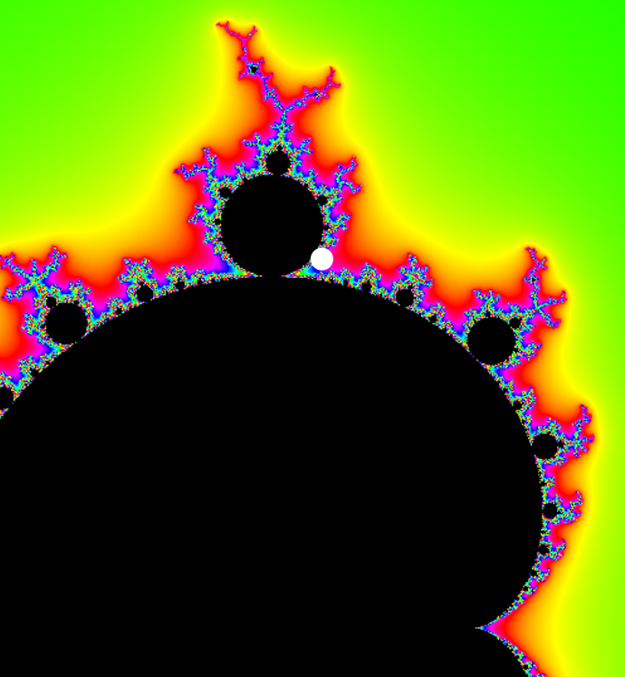
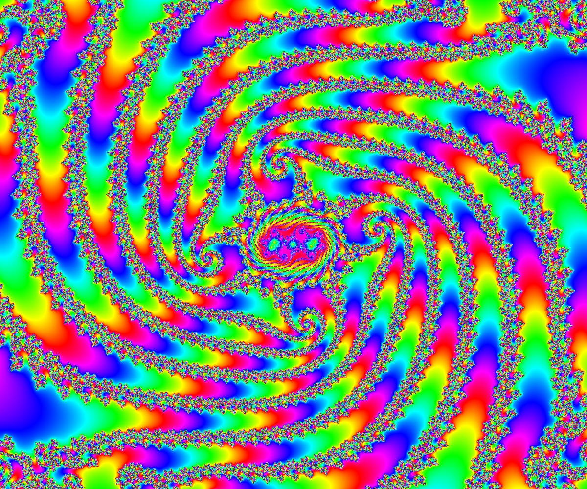
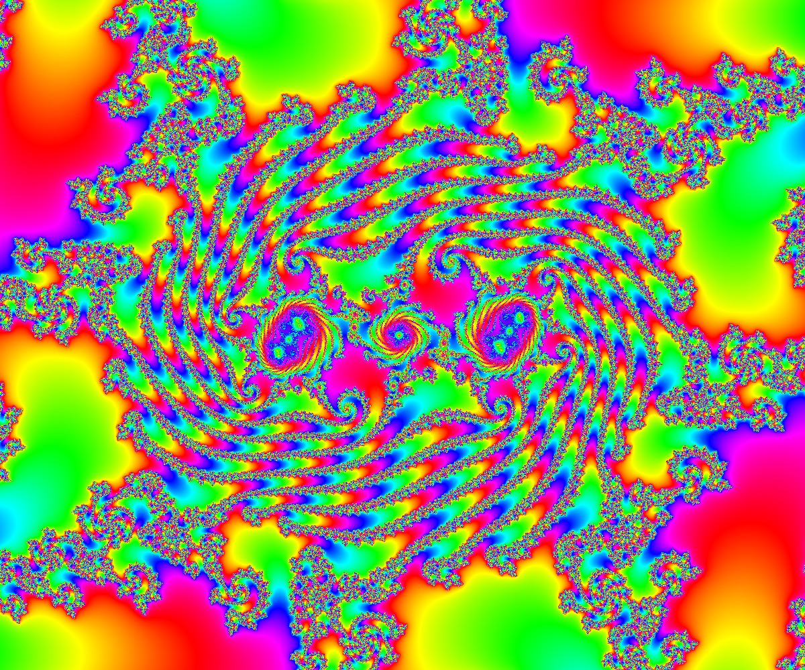
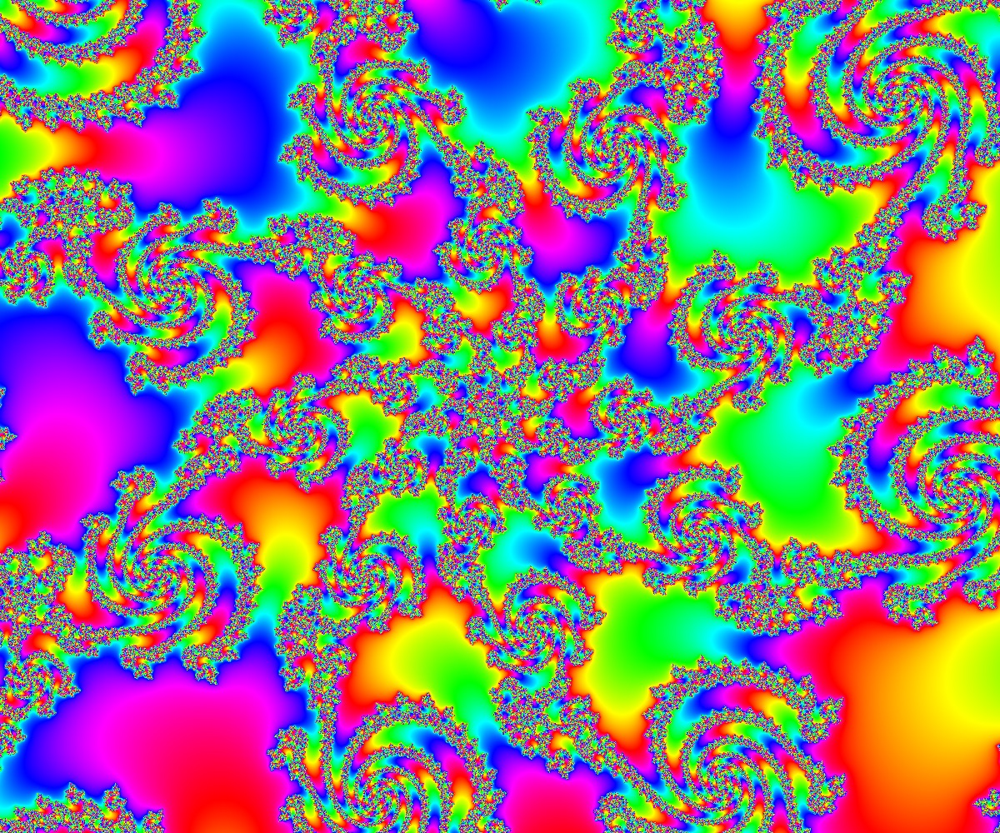

# AAE

Contributed by:

- [github.com/brucehjohnson](https://github.com/brucehjohnson)

Discoveries folder:

- [MandArt-Discoveries/brucehjohnson](https://github.com/denisecase/MandArt-Discoveries/tree/main/brucehjohnson)

-----

These are taken from the AAE region. 

-----

## AAE1

<a href="AAE1.mandart" download="AAE1.mandart">Click here to download</a> 

## AAE2

<a href="AAE2.mandart" download="AAE2.mandart">Click here to download</a> 

## AAE3

<a href="AAE3.mandart" download="AAE3.mandart">Click here to download</a> 

## AAE4

<a href="AAE4.mandart" download="AAE4.mandart">Click here to download</a> 

## AAE5

<a href="AAE5.mandart" download="AAE5.mandart">Click here to download</a> 

