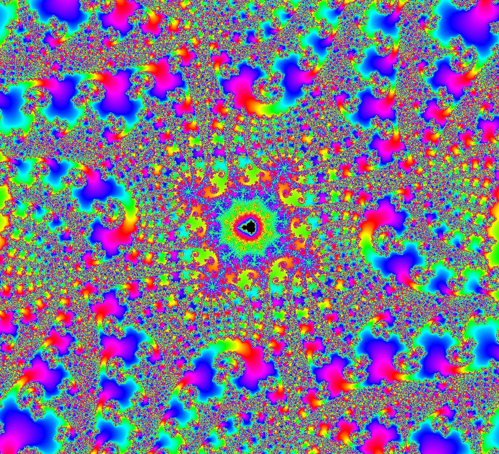

# G_10

Contributed by:

- [github.com/brucehjohnson](https://github.com/brucehjohnson)

Discoveries folder:

- [MandArt-Discoveries/brucehjohnson](https://github.com/denisecase/MandArt-Discoveries/tree/main/brucehjohnson)

-----

These are taken from the G_10 region.

-----

## AAB1

<a href="AAB1.mandart" download="AAB1.mandart">Click here to download</a> 

## AAB2

<a href="AAB2.mandart" download="AAB2.mandart">Click here to download</a> 

## AAB3

<a href="AAB3.mandart" download="AAB3.mandart">Click here to download</a> 

## Top

<a href="Top.mandart" download="Top.mandart">Click here to download</a> 

## Top1

<a href="Top1.mandart" download="Top1.mandart">Click here to download</a> 

